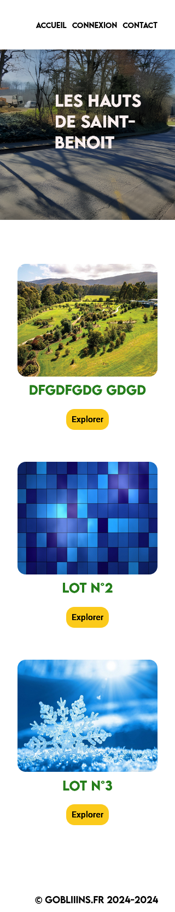
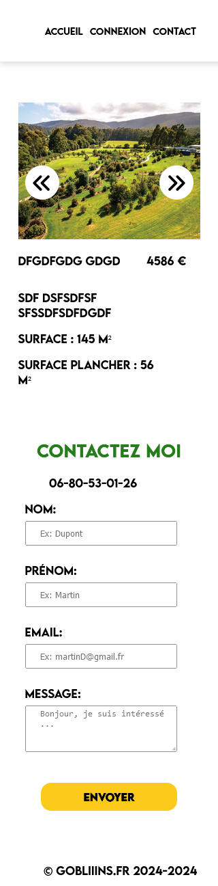
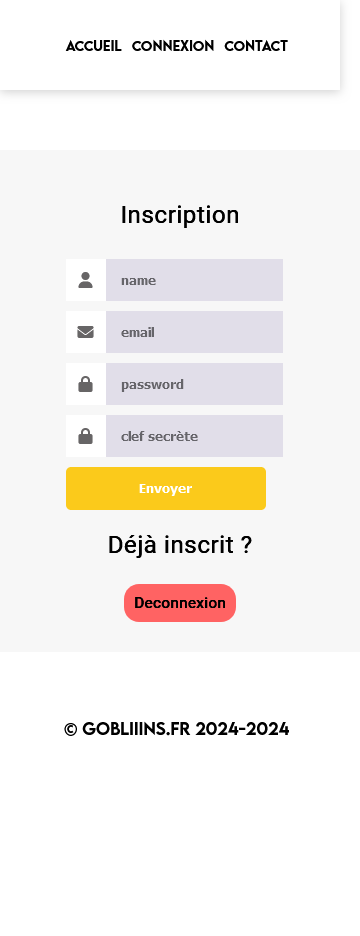
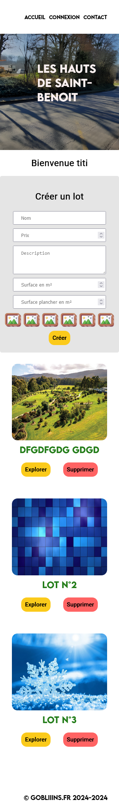
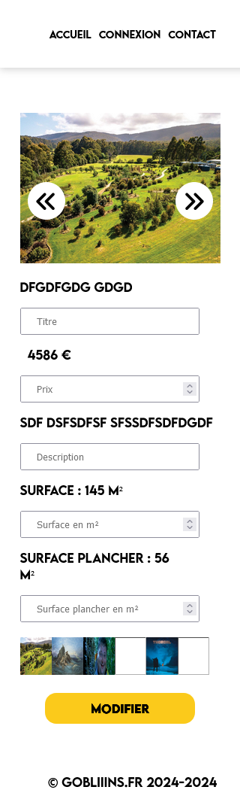

# Application monolithique php MVC

## Site de location de terrains

                     

## Technos :

## Description:

Application php monolithique en MVC

### Installer php et composer 

### Installer les dépendances avec composer
`composer install`
