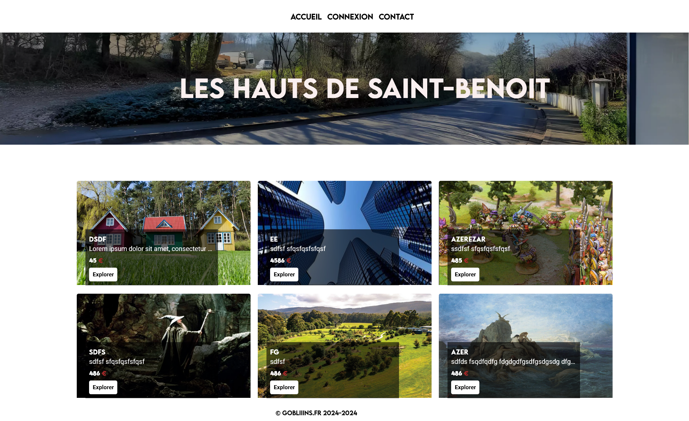
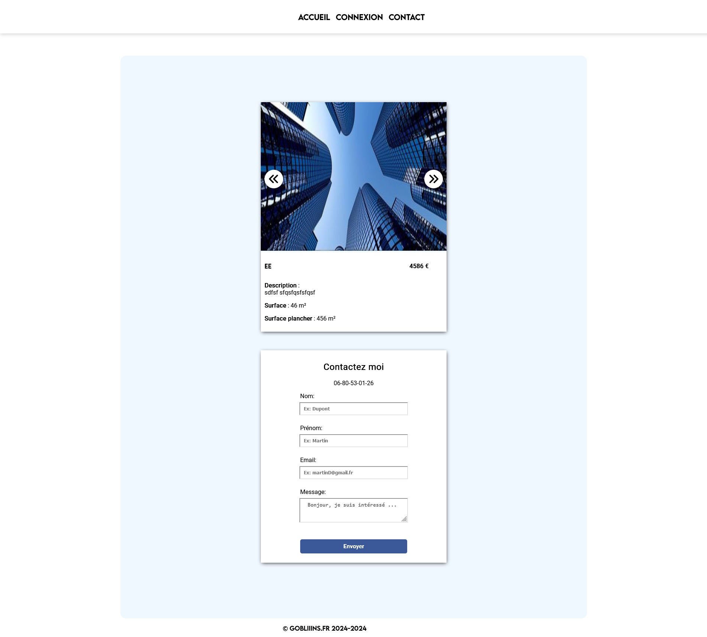

# Application monolithique php MVC

## Site de location de terrains

                     

## Technos :

## Description:

Application php monolithique en MVC

### Modifications:
Changer l'email dans controllers/focus( La logique server n'a pas été configuré pour l'utilisation en localhost) 
Changer le code sercret dans controllers/auth 
Changer les identifiants dans models/utils 
Créer un dossier vendor à la racine 
Créer un dossier lots dans public/assets/pictures 

### configuration de la BDD
type: innoDB  

Table lot: 
uuid varchar(250) primary key 
name varchar(250) 
description text 
price int 
surface int 
surface_plancher int 
image_1 à image_6 varchar(250)  

Table user: 
uuid varchar(250) primary key 
name varchar(250) 
email varchar(250) 
password text 

### Installer php et composer 

### Installer les dépendances avec composer
`composer install`
